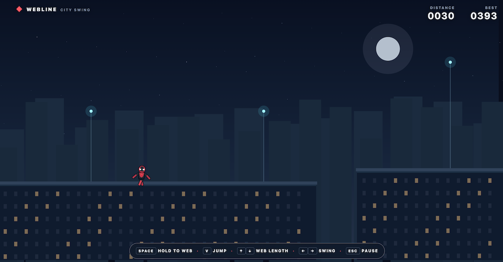
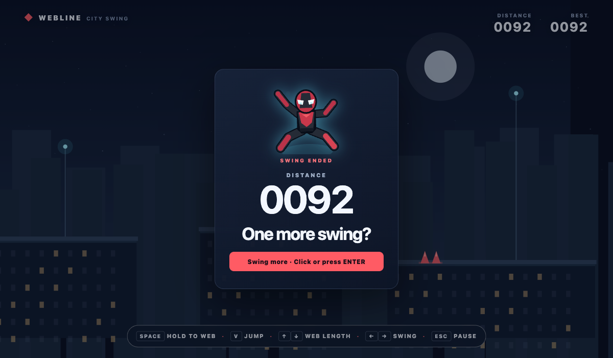

# Webline — City Swing

Webline is a fast, momentum-driven rooftop swinging game built with plain HTML, CSS, JavaScript, and Canvas. Jump between procedural city blocks, attach to glowing mast nodes, build speed through the swing, and release at the right moment to clear the next gap.

<p align="center">
  <a href="https://webline-city-swing.sailaopoeng.com/"><strong>Play the live demo →</strong></a>
</p>

## Screenshots

<p align="center">
  
  
</p>

## Features

- Momentum-based web swinging with taut rope constraints
- Procedurally generated rooftops, gaps, mast nodes, and spike clusters
- Jumping, rope length control, swing pumping, and glide unlocks
- Responsive keyboard, mouse, touch, and on-screen mobile controls
- Camera zoom, motion trails, attach effects, milestone confetti, and a dancing death screen
- Distance score and optional best score saved in `localStorage`
- No build step, dependencies, backend, or game engine

## Controls

| Action | Keyboard | Mouse / touch |
| --- | --- | --- |
| Attach or hold the web | Hold `Space` | Hold the game surface or **WEB** |
| Jump | `V` | **JUMP** |
| Shorten the web | `↑` / `W` | **SHORTER** |
| Let out the web | `↓` / `S` | **LONGER** |
| Pump the swing | `←` / `A`, `→` / `D` | — |
| Pause or resume | `Esc` | **PAUSE** |
| Reset during a run | `R` | — |

Release the web to preserve your swing momentum. After ten successful airborne rope releases, glide becomes available.

## Run locally

Open `index.html` in a modern browser, or start a local server from the project directory:

```bash
python3 -m http.server
```

Then open [http://localhost:8000](http://localhost:8000).

## Project structure

| File | Purpose |
| --- | --- |
| `index.html` | Canvas, HUD, controls, and game state screens |
| `style.css` | Responsive layout and visual styling |
| `game.js` | Input, world generation, physics, collisions, camera, and drawing |
| `docs/screenshot1.png` | Gameplay screenshot used in the README |
| `docs/screenshot.png` | End screen screenshot used in the README |
| `dist/` | Static deployment copy for hosting |

The main tuning values live near the top of `game.js`. See `AGENTS.md` for the physics model, control decisions, and checks used when changing the game.

## Hosted version

Play the project online at [webline-city-swing.sailaopoeng.com](https://webline-city-swing.sailaopoeng.com/).
