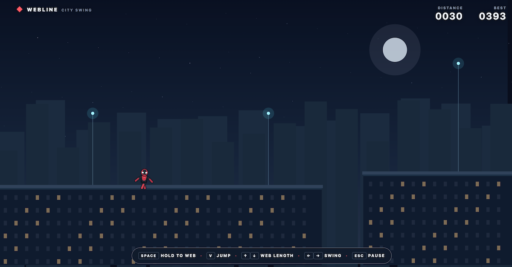
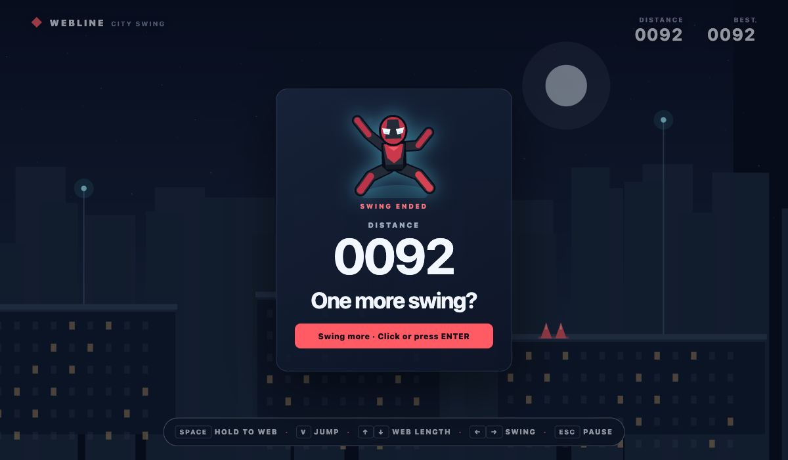

# Webline — City Swing

Webline is a fast, momentum-driven rooftop swinging game built with plain HTML, CSS, JavaScript, and Canvas. Jump between procedural city blocks, attach to glowing mast nodes, build speed through the swing, and release at the right moment to clear the next gap.

<p align="center">
  <a href="https://webline-city-swing.sailaopoeng.com/"><strong>Play the live demo →</strong></a>
</p>

## Screenshots

<p align="center">
  
  
</p>

## Features

- Momentum-based web swinging with taut rope constraints
- 100 levels across ten city districts, each about 1% harder, then an endless mode
- Finish gates, level-clear celebration with stars, and five attempts per level
- Points from distance × level, web combos, near misses, glides, and tokens
- Power-ups: Rocket Boots, Glide Feather, Wingsuit, Shield, Web Magnet, and a rare teleport portal
- Procedurally generated rooftops, gaps, mast nodes, and spike clusters
- Jumping, rope length control, swing pumping, and stored glide charges with auto-glide
- Responsive keyboard, mouse, touch, and on-screen mobile controls
- Camera zoom, motion trails, attach effects, milestone confetti, and a dancing death screen
- Level progress, best points, and best level saved in `localStorage`
- No build step, dependencies, backend, or game engine

## Controls

| Action | Keyboard | Mouse / touch |
| --- | --- | --- |
| Attach or hold the web | Hold `Space` | Hold the game surface or **WEB** |
| Jump (on a roof) / glide (in the air) | `V` | **JUMP** / **GLIDE** |
| Shorten the web | `↑` / `W` | **SHORTER** |
| Let out the web | `↓` / `S` | **LONGER** |
| Pump the swing | `←` / `A`, `→` / `D` | — |
| Pause or resume | `Esc` | **PAUSE** |
| Restart the level (uses an attempt once started) | `R` | — |
| Continue after a level clear | `Enter` / `Space` | **Level N →** |

Release the web to preserve your swing momentum. Every ten airborne rope releases earns a glide charge (up to three). Use it with `V` in the air, or let it open by itself when you fall into a gap.

## Levels and points

Reach the finish gate to clear a level. Level 1 is 1000 m and each level adds 15 m. Gaps get wider, spikes more common, and roofs narrower by about 1% per level. You get five attempts per level; running out sends you back to level 1. Progress is saved, so a reload continues where you left off (add `?level=N` to the URL to jump to a level for testing). Clear level 100 to conquer the city and unlock endless mode.

Points = distance × level multiplier + bonuses (web combos, near misses over spikes, glides, tokens), then a clear bonus and a time bonus for beating par.

| Pickup | Effect |
| --- | --- |
| Rocket Boots | Fly forward with thrust and lift for 2.5 seconds |
| Glide Feather | One extra glide charge |
| Wingsuit | Longer, flatter glides for the rest of the level |
| Shield | Survive one spike or wall hit |
| Web Magnet | Longer web reach and token pull for 8 seconds |
| Teleport portal | Rare. Touch it or web it to warp to a couple of roofs before the finish (skipped distance earns no points) |
| Token | Points |

## Run locally

Open `index.html` in a modern browser, or start a local server from the project directory:

```bash
python3 -m http.server
```

Then open [http://localhost:8000](http://localhost:8000).

## Project structure

| File | Purpose |
| --- | --- |
| `index.html` | Canvas, HUD, controls, and game state screens |
| `style.css` | Responsive layout and visual styling |
| `game.js` | Input, world generation, physics, collisions, camera, and drawing |
| `docs/screenshot1.png` | Gameplay screenshot used in the README |
| `docs/screenshot.png` | End screen screenshot used in the README |
| `infra/aws/` | AWS S3 + CloudFront hosting template and setup guide |
| `.github/workflows/deploy-aws.yml` | Deploys to AWS on push to `main` |

## Roadmap

- Audio: sound effects and district music with a mute toggle
- Menus: title screen, level select for cleared levels, and settings

The main tuning values live near the top of `game.js`. See `AGENTS.md` for the physics model, control decisions, and checks used when changing the game.

## Hosted version

Play the project online at [webline-city-swing.sailaopoeng.com](https://webline-city-swing.sailaopoeng.com/).

To host it on AWS (S3 + CloudFront + Route 53) with automatic deploys from GitHub, see [`infra/aws/README.md`](infra/aws/README.md).
